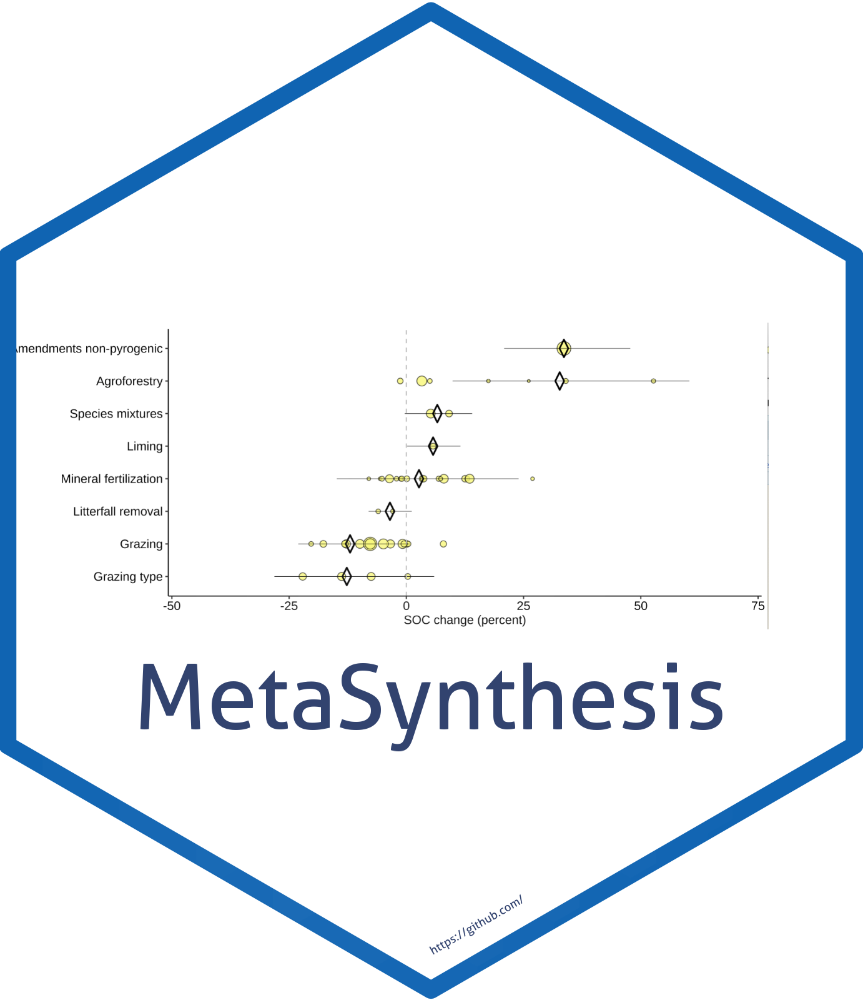

<!-- README.md is generated from README.Rmd. Please edit that file -->

# MetaSynthesis 

<!-- badges: start -->

[](https://github.com/dbeillouin/MetaSynthesis/actions/workflows/R-CMD-check.yaml)
[](https://github.com/dbeillouin/MetaSynthesis/actions/workflows/pkgdown.yaml)
[](https://github.com/dbeillouin/MetaSynthesis/actions/workflows/test-coverage.yaml)
[](https://codecov.io/gh/dbeillouin/MetaSynthesis)
[](https://CRAN.R-project.org/package=MetaSynthesis)
[](https://choosealicense.com/licenses/gpl-2.0/)
[](https://lifecycle.r-lib.org/articles/stages.html#experimental)
[](https://www.repostatus.org/#concept)
[](#)
<!-- badges: end -->

The goal of the R package `MetaSynthesis` is to analyse the effect of
various human intervention on soil organic carbon.

## Installation

You can install the development version from
[GitHub](https://github.com/) with:

``` r
# install.packages("remotes")
remotes::install_github("dbeillouin/MetaSynthesis")
```

Then you can attach the package `MetaSynthesis`:

``` r
library("MetaSynthesis")
```

## Overview

Here is an overview of `MetaSynthesis` content: this package allows the
reproduction of the figures associated with the paper Beillouin et al,
2022

## Citation

Please cite this package as:

> Beillouin Damien (2023) MetaSynthesis: An R package to analyse the
> impacts of human intervention on soil organic carbon. R package
> version 0.0.0.9000.

## Code of Conduct

Please note that the `MetaSynthesis` project is released with a
[Contributor Code of
Conduct](https://contributor-covenant.org/version/2/0/CODE_OF_CONDUCT.html).
By contributing to this project, you agree to abide by its terms.
